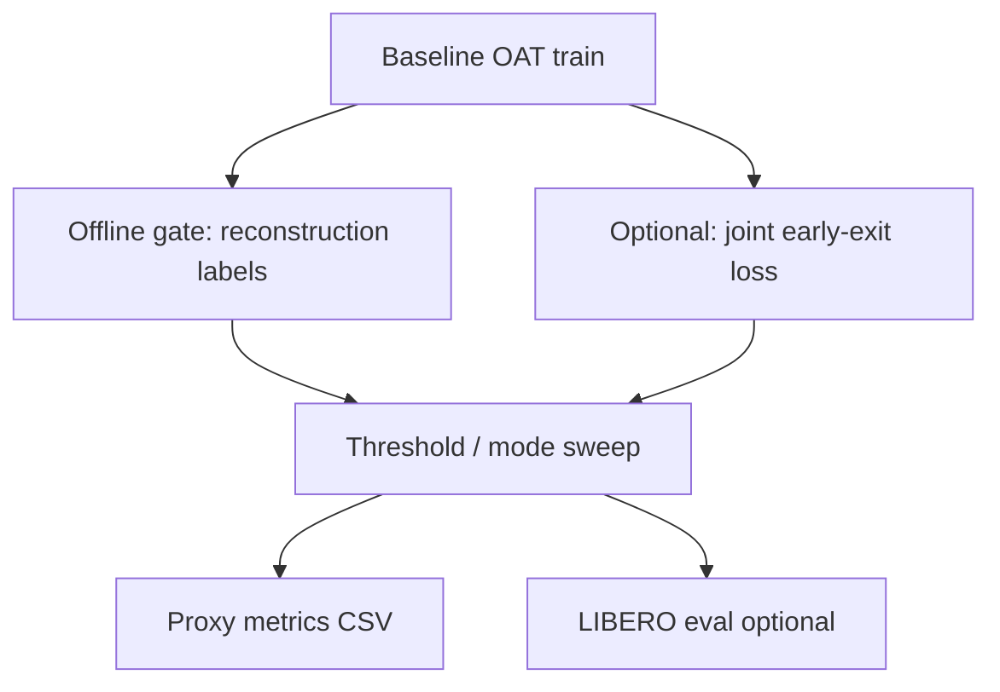

<div align="center">

# OAT · Adaptive Early Exit

**Learned and heuristic early stopping for autoregressive OAT action tokens**  
*Extends [OAT](https://github.com/Chaoqi-LIU/oat) with an adaptive compute–quality trade-off at decode time.*

```text
  obs ──► encoder ──► LM + KV cache ──► logits ──► sample
                           │                    │
                           └──── early-exit ◄───┘
                                 gate | max-p
```

</div>

---

## System snapshot

| Layer | Role |
|--------|------|
| **Policy** | OAT autoregressive tokenizer over discrete action tokens |
| **Extension** | `EarlyExitGate` (MLP on `ln_f` hidden) or `max_prob` heuristic |
| **Objective** | Shorter generations when confident / well-reconstructed; full horizon when not |
| **Artifacts** | `src/oat_ext/*`, patched `third_party/oat` transformer + policy |

---

## Research framing (BLT · H-Net · OAT)

This fork sits at the **intersection of ideas** from recent work on **adaptive / structured token streams** and **VLA-style action tokenization**: [BLT](https://arxiv.org/abs/2412.09871v1) motivates *not spending full compute everywhere*; [H-Net](https://arxiv.org/abs/2507.07955) suggests *hierarchical structure* in long-horizon behaviour; [OAT](https://github.com/Chaoqi-LIU/oat) provides the **ordered autoregressive action-token policy** we actually run in LIBERO. We do **not** ship a literal merged BLT+OAT architecture; we implement a **pragmatic hypothesis**—**adaptive early exit during AR decode**—as the engineering “wedge” (see [`docs/early-exit.md`](docs/early-exit.md)). Course-style submission notes in Russian: [`docs/TEST_ASSIGNMENT_SUBMISSION.md`](docs/TEST_ASSIGNMENT_SUBMISSION.md).

---

## Repository map

| Path | Contents |
|------|----------|
| `src/oat_ext/` | `EarlyExitGate`, supervision helpers, config merge |
| `scripts/` | Install, offline gate training, threshold sweeps, `vast_run_early_exit.sh`, `plot_sweep_csv.py`, eval helpers |
| `tests/` | `pytest` for `oat_ext` (see `pytest.ini` → `pythonpath = src`) |
| `docs/` | `early-exit.md`, `experiments-section-template.md`, `results-and-visuals.md` |
| `third_party/oat/` | Vendored OAT with local modifications |

---

## Quick start

```bash
# 1) OAT environment + deps
./scripts/install_oat.sh

# 2) LIBERO-10 zarr (if running full pipeline)
./scripts/download_libero10_zarr.sh
```

If `uv` is not on PATH:

```bash
export PATH="$HOME/.local/bin:$PATH"
```

---

## Execution graph



1. **Train baseline** — upstream configs (GPU recommended; requires LIBERO-10 zarr under `third_party/oat/data/`):

   ```bash
   ./scripts/train_baseline.sh
   ```

   Smoke run:

   ```bash
   ./scripts/train_baseline.sh training.num_epochs=1 training.val_every=1 dataloader.batch_size=4
   ```

2. **Train `EarlyExitGate` offline** (reconstruction-supervised):

   ```bash
   cd third_party/oat
   uv run python ../../scripts/train_early_exit_offline.py \
     --checkpoint /path/to/policy.ckpt \
     --mse-threshold 0.015 \
     --epochs 3 \
     --max-batches 100 \
     --out-gate ../../checkpoints/early_exit_gate.pt
   ```

3. **Sweep thresholds** → CSV proxy metrics:

   ```bash
   uv run python ../../scripts/sweep_early_exit.py \
     --checkpoint /path/to/policy.ckpt \
     --mode gate \
     --gate ../../checkpoints/early_exit_gate.pt \
     --thresholds 0.7 0.8 0.9 \
     --max-batches 50 \
     --out-csv ../../experiments/runs/sweep_gate.csv
   ```

   Max-probability baseline:

   ```bash
   uv run python ../../scripts/sweep_early_exit.py \
     --checkpoint /path/to/policy.ckpt \
     --mode maxprob \
     --thresholds 0.7 0.8 0.9 \
     --max-batches 50 \
     --out-csv ../../experiments/runs/sweep_maxprob.csv
   ```

4. **Simulator (optional)**:

   ```bash
   ./scripts/eval_libero.sh /path/to/oatpolicy.ckpt --num_exp 5
   ```

---

## Hydra · inference overrides

```bash
policy.early_exit_gate._target_=oat_ext.early_exit.EarlyExitGate
policy.early_exit_gate.n_emb=256
policy.early_exit_gate_checkpoint=/path/to/early_exit_gate.pt
policy.use_early_exit_inference=true
policy.early_exit_threshold=0.9
```

---

## Fork touchpoints

| File | Delta |
|------|--------|
| `third_party/oat/oat/model/autoregressive/transformer_cache.py` | `return_hidden`; early-exit inside `generate()` |
| `third_party/oat/oat/policy/oatpolicy.py` | Gate wiring, checkpoint load, inference flags |

---

## Tests

Lightweight checks for `oat_ext` only. **Option A** — minimal venv (matches CI): `pytest` + `omegaconf` + `torch`. **Option B** — after `./scripts/install_oat.sh`, use the OAT `.venv`:

```bash
pip install -r requirements.txt
pip install "torch>=2.0.0"
pytest
```

```bash
# After ./scripts/install_oat.sh (torch already in third_party/oat/.venv)
./third_party/oat/.venv/bin/python -m pytest
```

---

## Remote GPU (Vast-style)

After syncing the repo on a rented GPU, run the bundled pipeline (writes `checkpoints/early_exit_gate.pt` and `experiments/runs/sweep_gate_trained.csv` by default):

```bash
./scripts/vast_run_early_exit.sh --checkpoint /path/to/policy.ckpt
```

Then add figures and benchmark tables using [docs/results-and-visuals.md](docs/results-and-visuals.md) (CSV schema, plot script, suggested tables).

### Before you delete the instance (backup checklist)

Weights and eval dirs are **`.gitignore`d**—GitHub only holds code and docs. **Pull everything you care about off the machine before teardown.**

**1. On the server** (adjust paths to your run; example layout from a typical train + eval):

```bash
cd /path/to/oat-early-exit   # repo root on the instance
RUN_DIR=third_party/oat/output/manual/train30_20260411_134306
EVAL_DIR=experiments/runs/eval_libero_7to8h_20260412_112444
shopt -s nullglob   # omit empty globs
RUN_CSVS=(experiments/runs/*.csv)

tar -czvf ~/oat_lab_backup.tgz \
  "$RUN_DIR/checkpoints/latest.ckpt" \
  "$RUN_DIR/logs.json" \
  "$EVAL_DIR/eval_log.json" \
  "${RUN_CSVS[@]}"
```

Add Hydra overrides, `tmux` logs, or extra paths by appending more arguments before `"${RUN_CSVS[@]}"`.

**2. Copy to your laptop** (from your machine, not from inside SSH):

```bash
scp -P <PORT> -i ~/.ssh/<key> root@<HOST>:~/oat_lab_backup.tgz .
mkdir -p artifacts && tar -xzvf oat_lab_backup.tgz -C artifacts
```

Keep `artifacts/` **local** (it is gitignored). For examiners, attach **`oat_lab_backup.tgz`** or a subset (ckpt + `eval_log.json` + `logs.json`) to email / cloud / Zenodo.

**3. Hugging Face Hub (optional)** — good for sharing a **policy** checkpoint with a short Model Card (what data, `n_test`, commit hash). Use **Git LFS** for `*.ckpt` or `huggingface_hub` `upload_file`; check your **storage quota** (large files can exceed free tiers). This repo does not automate uploads.

**4. Long-term archive** — if HF is awkward, **[Zenodo](https://zenodo.org/)** (or institutional storage) for a single `.tgz` is often simpler for coursework.

### English figures for reports / slides

Use [docs/results-and-visuals.md](docs/results-and-visuals.md): Pareto-style plots (threshold vs early-exit rate vs proxy MSE), training curves, optional LIBERO success bars. **Set axis titles and legends in English** in `scripts/plot_sweep_csv.py` (or post-process labels) and save under `docs/assets/` (create the folder if missing), then embed in README or the PDF report.

---

## Documentation

| Doc | Purpose |
|-----|---------|
| [docs/early-exit.md](docs/early-exit.md) | Pipeline, hypothesis, APIs, Hydra, limitations |
| [docs/TEST_ASSIGNMENT_SUBMISSION.md](docs/TEST_ASSIGNMENT_SUBMISSION.md) | Сдача тестового задания: инструменты, гипотеза BLT/H-Net/OAT, логи, repro, черновик отчёта |
| [docs/experiments-section-template.md](docs/experiments-section-template.md) | Report-ready experiment skeleton |
| [docs/results-and-visuals.md](docs/results-and-visuals.md) | Post-run artifacts, plots, README benchmark strip |
