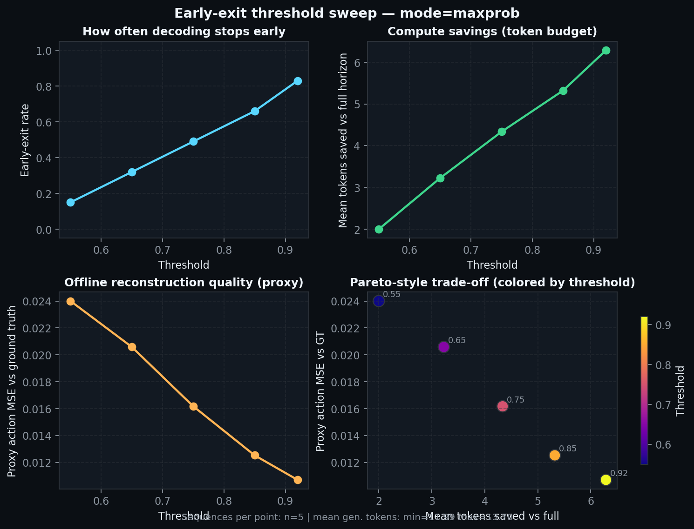
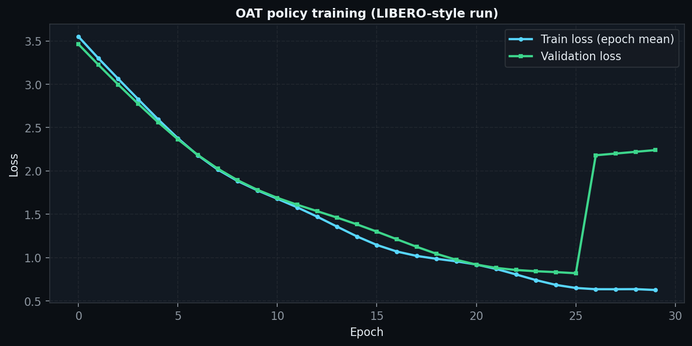
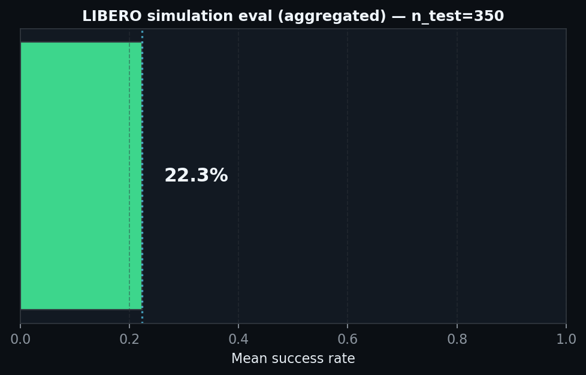
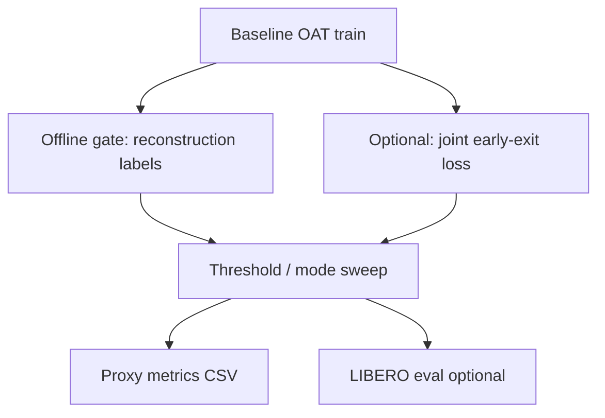

<div align="center">

# OAT · Adaptive Early Exit

**Learned and heuristic early stopping for autoregressive OAT action tokens**  
*Extends [OAT](https://github.com/Chaoqi-LIU/oat) with an adaptive compute–quality trade-off at decode time.*

```text
  obs ──► encoder ──► LM + KV cache ──► logits ──► sample
                           │                    │
                           └──── early-exit ◄───┘
                                 gate | max-p
```

<p align="center">
  <a href="https://github.com/GadzhiAskhabaliev/oat-early-exit"></a>
  <a href="https://huggingface.co/hackhackhack66666/oat-libero-policy-early-exit"></a>
  <a href="https://www.python.org/downloads/"></a>
</p>

<p align="center">
  <a href="https://arxiv.org/abs/2412.09871v1"></a>
  <a href="https://arxiv.org/abs/2507.07955"></a>
  <a href="https://github.com/Chaoqi-LIU/oat"></a>
</p>

</div>

---

## System snapshot

| Layer | Role |
|--------|------|
| **Policy** | OAT autoregressive tokenizer over discrete action tokens |
| **Extension** | `EarlyExitGate` (MLP on `ln_f` hidden) or `max_prob` heuristic |
| **Objective** | Shorter generations when confident / well-reconstructed; full horizon when not |
| **Artifacts** | `src/oat_ext/*`, patched `third_party/oat` transformer + policy |

---

## Research framing (BLT · H-Net · OAT → early exit)

The assignment suggested **bridging** lines of work on VLA tokenization. Here, **early exit** is the concrete hypothesis you get when you read the three references together:

| Paper | Takeaway we borrow | How it maps to this repo |
|-------|---------------------|---------------------------|
| **[BLT](https://arxiv.org/abs/2412.09871v1)** | Adaptive compute — not every step needs the same depth / budget | Stop AR decoding early when the model is already “good enough” |
| **[H-Net](https://arxiv.org/abs/2507.07955)** | Hierarchy — long-horizon structure in behaviour | Treat the **token horizon** as a budget: short prefix for easy phases, full length when hard |
| **[OAT](https://github.com/Chaoqi-LIU/oat)** | Ordered discrete **action tokens** + AR policy | The **implementation substrate** (LIBERO policy, KV cache, `generate()`) |

We **do not** ship a literal fused BLT+OAT backbone. We ship a **research-grade engineering wedge**: **adaptive early exit inside OAT’s autoregressive decode** (`EarlyExitGate` or `max_prob`, Hydra toggles) — see [`docs/early-exit.md`](docs/early-exit.md).  
Course submission packet (RU): [`docs/TEST_ASSIGNMENT_SUBMISSION.md`](docs/TEST_ASSIGNMENT_SUBMISSION.md).

### Visual results (report kit)

Illustrative PNGs (dark theme, English labels). **Synthetic demo fixtures** ship in-repo so GitHub always renders something meaningful; replace with your artifacts and rerun `python scripts/generate_report_assets.py` or the individual `scripts/plot_*.py` tools.

| Early-exit sweep (proxy) | Training curves | LIBERO eval snapshot |
|--------------------------|-----------------|----------------------|
|  |  |  |

---

## Repository map

| Path | Contents |
|------|----------|
| `src/oat_ext/` | `EarlyExitGate`, supervision helpers, config merge |
| `scripts/` | Install, offline gate, sweeps, `plot_*.py`, `generate_report_assets.py`, `plot_real_bundle.sh`, `tar_lab_backup.sh`, `push_checkpoint_to_hf.py`, eval helpers |
| `tests/` | `pytest` for `oat_ext` (see `pytest.ini` → `pythonpath = src`) |
| `docs/` | `early-exit.md`, `assets/` (figures), `experiments-section-template.md`, `results-and-visuals.md` |
| `third_party/oat/` | Vendored OAT with local modifications |

---

## Quick start

```bash
# 1) OAT environment + deps
./scripts/install_oat.sh

# 2) LIBERO-10 zarr (if running full pipeline)
./scripts/download_libero10_zarr.sh
```

If `uv` is not on PATH:

```bash
export PATH="$HOME/.local/bin:$PATH"
```

---

## Execution graph



1. **Train baseline** — upstream configs (GPU recommended; requires LIBERO-10 zarr under `third_party/oat/data/`):

   ```bash
   ./scripts/train_baseline.sh
   ```

   Smoke run:

   ```bash
   ./scripts/train_baseline.sh training.num_epochs=1 training.val_every=1 dataloader.batch_size=4
   ```

2. **Train `EarlyExitGate` offline** (reconstruction-supervised):

   ```bash
   cd third_party/oat
   uv run python ../../scripts/train_early_exit_offline.py \
     --checkpoint /path/to/policy.ckpt \
     --mse-threshold 0.015 \
     --epochs 3 \
     --max-batches 100 \
     --out-gate ../../checkpoints/early_exit_gate.pt
   ```

3. **Sweep thresholds** → CSV proxy metrics:

   ```bash
   uv run python ../../scripts/sweep_early_exit.py \
     --checkpoint /path/to/policy.ckpt \
     --mode gate \
     --gate ../../checkpoints/early_exit_gate.pt \
     --thresholds 0.7 0.8 0.9 \
     --max-batches 50 \
     --out-csv ../../experiments/runs/sweep_gate.csv
   ```

   Max-probability baseline:

   ```bash
   uv run python ../../scripts/sweep_early_exit.py \
     --checkpoint /path/to/policy.ckpt \
     --mode maxprob \
     --thresholds 0.7 0.8 0.9 \
     --max-batches 50 \
     --out-csv ../../experiments/runs/sweep_maxprob.csv
   ```

4. **Simulator (optional)**:

   ```bash
   ./scripts/eval_libero.sh /path/to/oatpolicy.ckpt --num_exp 5
   ```

---

## Hydra · inference overrides

```bash
policy.early_exit_gate._target_=oat_ext.early_exit.EarlyExitGate
policy.early_exit_gate.n_emb=256
policy.early_exit_gate_checkpoint=/path/to/early_exit_gate.pt
policy.use_early_exit_inference=true
policy.early_exit_threshold=0.9
```

---

## Fork touchpoints

| File | Delta |
|------|--------|
| `third_party/oat/oat/model/autoregressive/transformer_cache.py` | `return_hidden`; early-exit inside `generate()` |
| `third_party/oat/oat/policy/oatpolicy.py` | Gate wiring, checkpoint load, inference flags |

---

## Tests

Lightweight checks for `oat_ext` only. **Option A** — minimal venv (matches CI): `pytest` + `omegaconf` + `torch`. **Option B** — after `./scripts/install_oat.sh`, use the OAT `.venv`:

```bash
pip install -r requirements.txt
pip install "torch>=2.0.0"
pytest
```

```bash
# After ./scripts/install_oat.sh (torch already in third_party/oat/.venv)
./third_party/oat/.venv/bin/python -m pytest
```

---

## Remote GPU (Vast-style)

After syncing the repo on a rented GPU, run the bundled pipeline (writes `checkpoints/early_exit_gate.pt` and `experiments/runs/sweep_gate_trained.csv` by default):

```bash
./scripts/vast_run_early_exit.sh --checkpoint /path/to/policy.ckpt
```

Then add figures and benchmark tables using [docs/results-and-visuals.md](docs/results-and-visuals.md) (CSV schema, plot script, suggested tables).

### Before you delete the instance (backup checklist)

Weights and eval dirs are **`.gitignore`d**—GitHub only holds code and docs. **Pull everything you care about off the machine before teardown.**

**1. On the server** (adjust paths to your run; example layout from a typical train + eval):

```bash
cd /path/to/oat-early-exit   # repo root on the instance
RUN_DIR=third_party/oat/output/manual/train30_20260411_134306
EVAL_DIR=experiments/runs/eval_libero_7to8h_20260412_112444
shopt -s nullglob   # omit empty globs
RUN_CSVS=(experiments/runs/*.csv)

tar -czvf ~/oat_lab_backup.tgz \
  "$RUN_DIR/checkpoints/latest.ckpt" \
  "$RUN_DIR/logs.json" \
  "$EVAL_DIR/eval_log.json" \
  "${RUN_CSVS[@]}"
```

Add Hydra overrides, `tmux` logs, or extra paths by appending more arguments before `"${RUN_CSVS[@]}"`.

**1b. Same thing, one script** (defaults match `train30_20260411_134306` + `eval_libero_7to8h_20260412_112444`; override with `OAT_BACKUP_*` env vars — see `scripts/tar_lab_backup.sh`):

```bash
cd ~/oat-early-exit && git pull origin main && ./scripts/tar_lab_backup.sh
```

**2. Copy to your laptop** (from your machine, not from inside SSH):

```bash
scp -P <PORT> -i ~/.ssh/<key> root@<HOST>:~/oat_lab_backup.tgz .
mkdir -p artifacts && tar -xzvf oat_lab_backup.tgz -C artifacts
```

Keep `artifacts/` **local** (it is gitignored). For examiners, attach **`oat_lab_backup.tgz`** or a subset (ckpt + `eval_log.json` + `logs.json`) to email / cloud / Zenodo.

**3. Hugging Face Hub (optional)** — upload from the server with the bundled script (uses resumable `upload_file`; no Git LFS clone needed on the instance):

```bash
export HF_TOKEN=hf_...   # https://huggingface.co/settings/tokens  (read + write on model repos)

cd /path/to/oat-early-exit
# once: ./scripts/install_oat.sh   # pulls huggingface_hub from requirements.txt

third_party/oat/.venv/bin/python scripts/push_checkpoint_to_hf.py \
  --repo-id YOUR_USERNAME/oat-libero-policy \
  --create-repo \
  --checkpoint third_party/oat/output/manual/train30_20260411_134306/checkpoints/latest.ckpt \
  --train-log third_party/oat/output/manual/train30_20260411_134306/logs.json \
  --eval-log experiments/runs/eval_libero_7to8h_20260412_112444/eval_log.json
```

Omit `--create-repo` if the model repo already exists on Hugging Face. Add `--private` with `--create-repo` for a private repo. Check **storage quota** on free tiers (~400 MiB checkpoints are usually fine).

**4. Long-term archive** — if HF is awkward, **[Zenodo](https://zenodo.org/)** (or institutional storage) for a single `.tgz` is often simpler for coursework.

### English figures for reports / slides

Regenerate everything from bundled **demo** CSV / logs / eval JSON:

```bash
pip install matplotlib
python scripts/generate_report_assets.py
```

Use your real sweep output:

```bash
python scripts/plot_sweep_csv.py --csv experiments/runs/sweep_gate.csv --out docs/assets/figure_early_exit_sweep.png
python scripts/plot_training_logs.py --logs path/to/logs.json --out docs/assets/figure_training_curves.png
python scripts/plot_eval_log.py --eval-log path/to/eval_log.json --out docs/assets/figure_eval_summary.png
```

**Copy from the GPU box, then plot (same style):** on your laptop create `artifacts/server_run/`, `scp` `logs.json` + `eval_log.json` (and optional sweep CSV) into it, then from repo root:

```bash
./scripts/plot_real_bundle.sh ./artifacts/server_run
# with early-exit sweep CSV:
./scripts/plot_real_bundle.sh ./artifacts/server_run ./artifacts/server_run/sweep_gate.csv
```

Schema and tables: [docs/results-and-visuals.md](docs/results-and-visuals.md).

---

## Documentation

| Doc | Purpose |
|-----|---------|
| [docs/early-exit.md](docs/early-exit.md) | Pipeline, hypothesis, APIs, Hydra, limitations |
| [docs/TEST_ASSIGNMENT_SUBMISSION.md](docs/TEST_ASSIGNMENT_SUBMISSION.md) | Course submission pack (RU): tools, BLT/H-Net/OAT hypothesis, logs, repro, draft report |
| [docs/experiments-section-template.md](docs/experiments-section-template.md) | Report-ready experiment skeleton |
| [docs/results-and-visuals.md](docs/results-and-visuals.md) | Post-run artifacts, plots, README benchmark strip |
