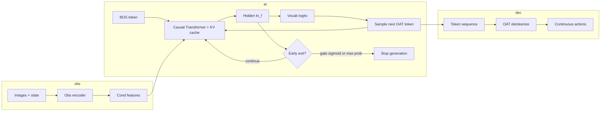

# Early exit for OAT policy (autoregressive action tokens)

## Pipeline (text → block diagram)



## Hypothesis

Adding an **early-exit mechanism** during autoregressive prediction of OAT discrete action tokens can **reduce inference latency** on easier decision points while keeping a fallback to the full token budget when the model is uncertain.

Two mechanisms are supported:

1. **Learned gate (`EarlyExitGate`)** — MLP on the LM hidden state (post-`ln_f`, pre-vocab head). Trained with a lightweight auxiliary BCE loss: label 1 on the **last** sequence position, 0 elsewhere (weak supervision; you can refine labels in future work).
2. **Heuristic (`early_exit_max_prob`)** — Stop when the max probability of the **next-token** distribution exceeds a threshold (no extra parameters).

## Code changes (vendor fork)

| File | Change |
|------|--------|
| `third_party/oat/oat/model/autoregressive/transformer_cache.py` | `forward(..., return_hidden=False)`; `generate(..., early_exit_gate, early_exit_threshold, early_exit_min_new_tokens, early_exit_max_prob)` |
| `third_party/oat/oat/policy/oatpolicy.py` | Optional gate, auxiliary loss, `predict_action(..., use_early_exit=False)` |
| `src/oat_ext/early_exit.py` | `EarlyExitGate` module |
| `src/oat_ext/early_exit_supervision.py` | Reconstruction MSE per prefix, labels, proxy stats |
| `scripts/train_early_exit_offline.py` | Train gate on frozen policy with reconstruction labels |
| `scripts/sweep_early_exit.py` | Threshold sweep for proxy metrics, prints/saves CSV |

## Proxy metrics (no full simulator budget)

Use these to plot a **speed / quality** story even with limited GPU time:

| Metric | How |
|--------|-----|
| **Prefix reconstruction MSE** | `mse_per_prefix(tokenizer, gt_actions, tokens)` → curve vs prefix length |
| **Early-exit rate** | Log `generated_seq_len` vs `latent_horizon`; `batch_early_exit_stats` |
| **Wall-clock per `predict_action`** | `time.perf_counter` around policy call (same device, warmup) |

Report template: see **[EXPERIMENTS_SECTION_TEMPLATE.md](EXPERIMENTS_SECTION_TEMPLATE.md)**.

Quick sweep command (offline, no simulator):

```bash
cd third_party/oat
uv run python ../../scripts/sweep_early_exit.py \
  --checkpoint /path/to/policy/latest.ckpt \
  --mode gate \
  --gate /path/to/early_exit_gate.pt \
  --thresholds 0.7 0.8 0.9 \
  --max-batches 50 \
  --out-csv ../../experiments/runs/early_exit_proxy.csv
```

## Offline gate training (reconstruction labels)

Stronger supervision than “1 only on last step”: for each prefix length \(k\), if MSE\((\text{decode}(t_{1:k}), a_{\text{gt}}) < \tau\), set label 1 at timestep \(k-1\).

```bash
cd third_party/oat
uv run python ../../scripts/train_early_exit_offline.py \
  --checkpoint /path/to/policy/latest.ckpt \
  --mse-threshold 0.01 \
  --epochs 5 \
  --max-batches 100 \
  --out-gate experiments/checkpoints/early_exit_gate.pt
```

The script auto-prepends `src/` and `third_party/oat` to `sys.path`. Requires an **OATPolicy** checkpoint and the same dataset config as training (zarr path must exist).
It logs `train_bce`, `train_acc`, `val_bce`, `val_acc` each epoch for quick sanity checks.

## Hydra overrides (example)

Run from `third_party/oat` with `PYTHONPATH` including this repo’s `src` (see `scripts/train_baseline.sh` pattern).

```bash
export PYTHONPATH="/path/to/mipt-lab-project/src:${PYTHONPATH}"
cd third_party/oat

HYDRA_FULL_ERROR=1 uv run accelerate launch --num_processes 1 scripts/run_workspace.py \
  --config-name=train_oatpolicy \
  task/policy=libero/libero10 \
  policy.action_tokenizer.checkpoint=/path/to/oattok.ckpt \
  policy.early_exit_gate._target_=oat_ext.early_exit.EarlyExitGate \
  policy.early_exit_gate.n_emb=256 \
  policy.early_exit_gate_checkpoint=/path/to/early_exit_gate.pt \
  policy.early_exit_loss_weight=0.05 \
  policy.early_exit_threshold=0.85 \
  policy.early_exit_min_new_tokens=2
```

**Confidence-only early exit (no MLP):**

```bash
... \
  policy.early_exit_gate=null \
  policy.early_exit_loss_weight=0.0 \
  policy.early_exit_max_prob=0.95 \
  policy.early_exit_min_new_tokens=2
```

Note: `null` for the gate may require your Hydra/OmegaConf version; alternatively omit gate keys and only set `early_exit_max_prob`.

## Inference

- `predict_action(..., use_early_exit=True)` enables early stopping for that call.
- Alternatively set **`policy.use_early_exit_inference=true`** in Hydra so `LiberoRunner` and other code paths that call `predict_action(obs_dict)` without extra kwargs still use early exit during rollouts.

Sweep **threshold** / **max_prob** and record mean wall-clock per rollout and task success rate.

## Repro checklist for graders

1. Install OAT (`./scripts/install_oat.sh` from lab root).
2. Train or obtain OAT tokenizer checkpoint; train policy with or without `early_exit_loss_weight`.
3. Run LIBERO eval (upstream `scripts/eval_policy_sim.py`) after patching the runner to pass `use_early_exit=True` if needed.

## Relating to BLT / H-Net (report wording)

- **BLT**: dynamic allocation of computation (here: stop generating when the LM / reconstruction signal says “enough”).
- **H-Net (narrative)**: a coarse vs fine hierarchy — “short prefix already specifies the motion” vs “need the full OAT token budget for detail.”

## Limitations

- End-to-end auxiliary BCE with **last-step-only** labels is weak; prefer **offline reconstruction labels** (`train_early_exit_offline.py`) or your own task-aware labels.
- Stopping too aggressively hurts success rate; sweep thresholds and tabulate trade-offs.
- Teacher-forcing hidden states used for offline training may not perfectly match KV-cache states at inference; still a standard approximation.
