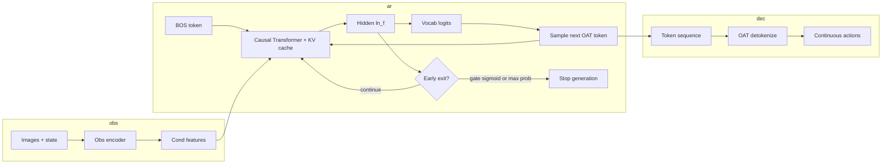

<div align="center">

# Early Exit · OAT Policy

**Autoregressive action tokens · adaptive decode depth**

[]()
[]()
[](../README.md)

</div>

> **TL;DR.** Stop generating OAT tokens when a learned gate or max-probability heuristic says the prefix is sufficient -- trading a bounded quality risk for lower average decode cost.

---

## Contents

1. [Dataflow](#dataflow-architecture)
2. [Hypothesis & mechanisms](#hypothesis)
3. [Code map](#code-map-vendor-fork)
4. [Proxy metrics](#proxy-metrics-no-full-simulator-budget)
5. [Offline gate training](#offline-gate-training-reconstruction-labels)
6. [Hydra](#hydra-overrides-example)
7. [Inference](#inference)
8. [Repro checklist](#repro-checklist-for-graders)
9. [Limitations](#limitations)

---

## Dataflow (architecture)



| Stage | Tensor / object | Note |
|-------|-----------------|------|
| Condition | `F` | Encoded observation conditions the LM |
| LM state | `H` @ step | Post-`ln_f`, pre-vocab head -- gate input |
| Decision | scalar / rule | Sigmoid threshold or `max(softmax)` |
| Output | token stream -> `A` | Standard OAT detokenize |

---

## Hypothesis

An **early-exit** mechanism during autoregressive OAT token prediction can **cut inference latency** on "easy" timesteps while preserving a fallback to the full token budget when the model is uncertain.

| Mechanism | Signal | Parameters |
|-----------|--------|------------|
| **Learned gate** (`EarlyExitGate`) | MLP on LM hidden (post-`ln_f`) | Trained with auxiliary BCE: label **1** on the **last** position, **0** elsewhere (weak; refinable) |
| **Heuristic** (`early_exit_max_prob`) | Max prob of **next-token** dist | Threshold only |

---

## Code map (vendor fork)

| File | Change |
|------|--------|
| `third_party/oat/oat/model/autoregressive/transformer_cache.py` | `forward(..., return_hidden=False)`; `generate(..., early_exit_gate, early_exit_threshold, early_exit_min_new_tokens, early_exit_max_prob)` |
| `third_party/oat/oat/policy/oatpolicy.py` | Optional gate, auxiliary loss, `predict_action(..., use_early_exit=False)` |
| `src/oat_ext/early_exit.py` | `EarlyExitGate` module |
| `src/oat_ext/early_exit_supervision.py` | Reconstruction MSE per prefix, labels, proxy stats |
| `scripts/train_early_exit_offline.py` | Train gate on frozen policy with reconstruction labels |
| `scripts/sweep_early_exit.py` | Threshold sweep, CSV export |

---

## Proxy metrics (no full simulator budget)

Build a **speed / quality** narrative without exhaustive rollouts:

| Metric | Instrument |
|--------|------------|
| **Prefix reconstruction MSE** | `mse_per_prefix(tokenizer, gt_actions, tokens)` vs prefix length |
| **Early-exit rate** | `generated_seq_len` vs `latent_horizon`; `batch_early_exit_stats` |
| **Wall-clock / `predict_action`** | `time.perf_counter`, same device, warmup |

Report skeleton: **[experiments-section-template.md](experiments-section-template.md)**.

<details>
<summary><strong>Offline sweep (copy-paste)</strong></summary>

```bash
cd third_party/oat
uv run python ../../scripts/sweep_early_exit.py \
  --checkpoint /path/to/policy/latest.ckpt \
  --mode gate \
  --gate /path/to/early_exit_gate.pt \
  --thresholds 0.7 0.8 0.9 \
  --max-batches 50 \
  --out-csv ../../experiments/runs/early_exit_proxy.csv
```

</details>

---

## Offline gate training (reconstruction labels)

Supervision tighter than "1 only on last step": for prefix length \(k\), if \(\text{MSE}(\text{decode}(t_{1:k}), a_{\text{gt}}) < \tau\), set label **1** at timestep \(k-1\).

```bash
cd third_party/oat
uv run python ../../scripts/train_early_exit_offline.py \
  --checkpoint /path/to/policy/latest.ckpt \
  --mse-threshold 0.01 \
  --epochs 5 \
  --max-batches 100 \
  --out-gate experiments/checkpoints/early_exit_gate.pt
```

The script prepends `src/` and `third_party/oat` to `sys.path`. Requires an **OATPolicy** checkpoint and a valid dataset config (zarr path). Logs `train_bce`, `train_acc`, `val_bce`, `val_acc` each epoch.

---

## Hydra overrides (example)

Run from `third_party/oat` with `PYTHONPATH` including this repo's `src` (see `scripts/train_baseline.sh`).

```bash
export PYTHONPATH="/path/to/oat-early-exit/src:${PYTHONPATH}"
cd third_party/oat

HYDRA_FULL_ERROR=1 uv run accelerate launch --num_processes 1 scripts/run_workspace.py \
  --config-name=train_oatpolicy \
  task/policy=libero/libero10 \
  policy.action_tokenizer.checkpoint=/path/to/oattok.ckpt \
  policy.early_exit_gate._target_=oat_ext.early_exit.EarlyExitGate \
  policy.early_exit_gate.n_emb=256 \
  policy.early_exit_gate_checkpoint=/path/to/early_exit_gate.pt \
  policy.early_exit_loss_weight=0.05 \
  policy.early_exit_threshold=0.85 \
  policy.early_exit_min_new_tokens=2
```

**Confidence-only early exit (no MLP):**

```bash
... \
  policy.early_exit_gate=null \
  policy.early_exit_loss_weight=0.0 \
  policy.early_exit_max_prob=0.95 \
  policy.early_exit_min_new_tokens=2
```

> **Note.** `null` for the gate depends on your Hydra/OmegaConf version; you can omit gate keys and only set `early_exit_max_prob`.

---

## Inference

| Entry point | Behavior |
|-------------|----------|
| `predict_action(..., use_early_exit=True)` | Early stopping for that call |
| `policy.use_early_exit_inference=true` | `LiberoRunner` and other paths that call `predict_action(obs_dict)` without extra kwargs |

Sweep **threshold** / **max_prob**; record mean wall-clock per rollout and task success.

---

## Repro checklist (graders)

1. Install OAT (`./scripts/install_oat.sh` from lab root).
2. Train or obtain OAT tokenizer checkpoint; train policy with or without `early_exit_loss_weight`.
3. Run LIBERO eval (upstream `scripts/eval_policy_sim.py`); patch runner to pass `use_early_exit=True` if required.

---

## Limitations

- End-to-end BCE with **last-step-only** labels is weak; prefer **offline reconstruction labels** (`train_early_exit_offline.py`) or task-aware labels.
- Aggressive stopping hurts success; sweep thresholds and tabulate trade-offs.
- Teacher-forcing hiddens for offline training approximate KV-cache states at inference.
