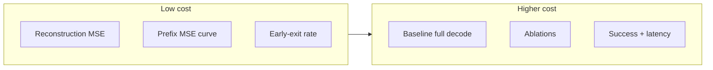

# Experiments · Report Template

**Structured protocol + results grid for the lab report**

Use this skeleton; plug in numbers after running protocols in [`early-exit.md`](early-exit.md). For figures, CSV columns, and README-ready benchmarks after remote runs, see [`results-and-visuals.md`](results-and-visuals.md).

---

## Experiment topology

---

## Environment specification

| Field | Fill in |
|-------|---------|
| **Hardware** | e.g. Colab Pro A100, cloud GPU SKU, local GPU |
| **Software** | OAT commit / fork date; `uv sync`; `PYTHONPATH` for `oat_ext` |
| **Checkpoints** | OAT tokenizer path; policy path (frozen or fine-tuned) |
| **Data** | LIBERO multitask zarr subset (N demos) if budget-limited |

---

## Protocol A -- Proxy metrics (no simulator)

Inexpensive signals when rollouts are too costly:

| # | Metric | Procedure |
|---|--------|-----------|
| 1 | **Action reconstruction MSE** | Held-out zarr slice: full sequence `tokenize -> detokenize`; report mean MSE (tokenizer quality smoke test). |
| 2 | **Prefix reconstruction curve** | For each prefix length \(k\): MSE between `detokenize(tokens[:, :k])` and GT actions (`oat_ext.early_exit_supervision.mse_per_prefix`). Plot mean MSE vs \(k\). |
| 3 | **Early-exit rate** | Fixed thresholds during `predict_action`: fraction stopping before `latent_horizon`; mean generated tokens (`batch_early_exit_stats`). |

---

## Protocol B -- Simulator (LIBERO)

| Arm | Configuration |
|-----|----------------|
| **Baseline** | Full-length generation (`use_early_exit_inference=false`) |
| **Ablations** | Max-prob: `early_exit_max_prob` in {0.90, 0.95, 0.99}; learned gate: thresholds in {0.7, 0.8, 0.9} |
| **Metrics** | Task success (mean +/- stderr over seeds); wall-clock ms per `predict_action` (sync, fixed batch size) |

---

## Results matrix (example)

| Method | Threshold | Success (%) | Avg. tokens | Latency (ms) |
|--------|-----------|-------------|-------------|--------------|
| No early exit | -- | ... | 8.0 | ... |
| Max prob | 0.95 | ... | ... | ... |
| Learned gate | 0.85 | ... | ... | ... |

---

## Limitations (required)

- Short training / few epochs / demo subset
- Reconstruction labels proxy task success, not guaranteed equivalence
- Possible off-by-one between gate timestep and "semantic" prefix -- document if observed

---

## Filled snapshot (this project, April 2026)

Copy or merge this block into the PDF report if you want the template **already populated** with the final LIBERO cycle. Numbers come from `logs.json` / `eval_log.json` and the debug journal; adjust if you re-run eval.

### Environment specification (filled)

| Field | Value |
|-------|--------|
| **Hardware** | Vast.ai rented Linux GPU box (SSH + tmux); exact SKU: run `nvidia-smi` on a fresh instance — varies by listing. |
| **Software** | Fork [`oat-early-exit`](https://github.com/GadzhiAskhabaliev/oat-early-exit) (`main` at submission time); `./scripts/install_oat.sh` → `third_party/oat/.venv`; `PYTHONPATH` includes `src` for `oat_ext`. |
| **Checkpoints** | **OATTok:** path from `OAT_TOK_CKPT` (not in git). **Policy:** `third_party/oat/output/manual/train30_20260411_134306/checkpoints/latest.ckpt` — mirror on [Hugging Face `hackhackhack66666/oat-libero-policy-early-exit`](https://huggingface.co/hackhackhack66666/oat-libero-policy-early-exit). |
| **Data** | LIBERO-10 multitask zarr `libero10_N500` (`copy_to_memory=false`); policy train with `lazy_eval=true`. |

### Protocol A (proxy / early-exit sweep)

| # | Status | Notes |
|---|--------|------|
| 1–3 | **Partial** | Offline gate + `sweep_early_exit.py` are supported in repo; a real sweep CSV was not committed in this submission snapshot. |

### Protocol B (LIBERO sim) — filled

| Arm | What we ran |
|-----|-------------|
| **Baseline policy eval** | `eval_policy_sim.py` on `latest.ckpt`; `mean_success_rate_mean` **≈ 0.223** (`eval_log.json`). |
| **Settings** | `n_test=350`, `n_parallel_envs=12`, `n_test_vis=0` — shorter than default 500 for wall-clock; document when comparing to papers. |
| **Artifact path** | `experiments/runs/eval_libero_7to8h_20260412_112444/eval_log.json` (on server; same metrics also uploaded to HF with logs). |

### Training signal (from epoch-end logs)

| Metric | Approx. |
|--------|---------|
| **`val_loss` (final epochs)** | ~**2.22** on last epoch of `train30_20260411_134306` (see training curve PNG in repo). |
| **`train_loss`** | Decreasing over 30 epochs; read `logs.json` for exact series — do not infer health from tqdm alone. |

### Results matrix (minimal — what we actually tabulated)

| Method | Threshold | Success (LIBERO sim) | Notes |
|--------|-----------|------------------------|------|
| OAT policy (no early-exit ablation in this eval row) | — | **≈ 22.3%** mean success (`n_test=350`) | Full early-exit threshold grid **not** re-run for this submission row. |

### Figures (committed)

| Figure | Path |
|--------|------|
| Training / validation loss | `docs/assets/figure_training_curves.png` |
| Eval summary bar | `docs/assets/figure_eval_summary.png` |

### Limitations (this run)

- No `n_test=500` table row in-repo unless you run a second eval.
- `lazy_eval=true`: no rollout metrics during training.
- HF + local `.tgz` backup — see [`libero-debug-journal.md`](libero-debug-journal.md).
