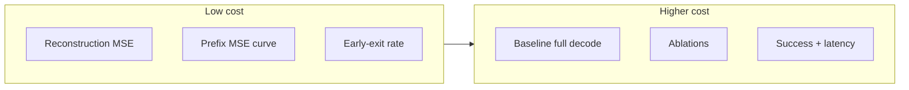

# Experiments · Report Template

**Structured protocol + results grid for the lab report**

Use this skeleton; plug in numbers after running protocols in [`early-exit.md`](early-exit.md). For figures, CSV columns, and README-ready benchmarks after remote runs, see [`results-and-visuals.md`](results-and-visuals.md).

---

## Experiment topology

---

## Environment specification

| Field | Fill in |
|-------|---------|
| **Hardware** | e.g. Colab Pro A100, cloud GPU SKU, local GPU |
| **Software** | OAT commit / fork date; `uv sync`; `PYTHONPATH` for `oat_ext` |
| **Checkpoints** | OAT tokenizer path; policy path (frozen or fine-tuned) |
| **Data** | LIBERO multitask zarr subset (N demos) if budget-limited |

---

## Protocol A — Proxy metrics (no simulator)

Inexpensive signals when rollouts are too costly:

| # | Metric | Procedure |
|---|--------|-----------|
| 1 | **Action reconstruction MSE** | Held-out zarr slice: full sequence `tokenize → detokenize`; report mean MSE (tokenizer quality smoke test). |
| 2 | **Prefix reconstruction curve** | For each prefix length \(k\): MSE between `detokenize(tokens[:, :k])` and GT actions (`oat_ext.early_exit_supervision.mse_per_prefix`). Plot mean MSE vs \(k\). |
| 3 | **Early-exit rate** | Fixed thresholds during `predict_action`: fraction stopping before `latent_horizon`; mean generated tokens (`batch_early_exit_stats`). |

---

## Protocol B — Simulator (LIBERO)

| Arm | Configuration |
|-----|----------------|
| **Baseline** | Full-length generation (`use_early_exit_inference=false`) |
| **Ablations** | Max-prob: `early_exit_max_prob` ∈ {0.90, 0.95, 0.99}; learned gate: thresholds ∈ {0.7, 0.8, 0.9} |
| **Metrics** | Task success (mean ± stderr over seeds); wall-clock ms per `predict_action` (sync, fixed batch size) |

---

## Results matrix (example)

| Method | Threshold | Success (%) | Avg. tokens ↓ | Latency (ms) ↓ |
|--------|-----------|-------------|---------------|----------------|
| No early exit | — | … | 8.0 | … |
| Max prob | 0.95 | … | … | … |
| Learned gate | 0.85 | … | … | … |

---

## Limitations (required)

- Short training / few epochs / demo subset
- Reconstruction labels proxy task success, not guaranteed equivalence
- Possible off-by-one between gate timestep and “semantic” prefix—document if observed

---

## BLT / H-Net · one paragraph (grader-facing)

Early exit allocates **less compute** when the model is confident or a short prefix reconstructs the action well—analogous in spirit to **adaptive depth / patch boundaries** in BLT. Frame it as a **two-level** decision: a coarse “stop generating tokens” choice before spending the full budget, narratively related to **hierarchical** processing in H-Net, even though the implementation is a compact gate rather than a full multi-scale backbone.
